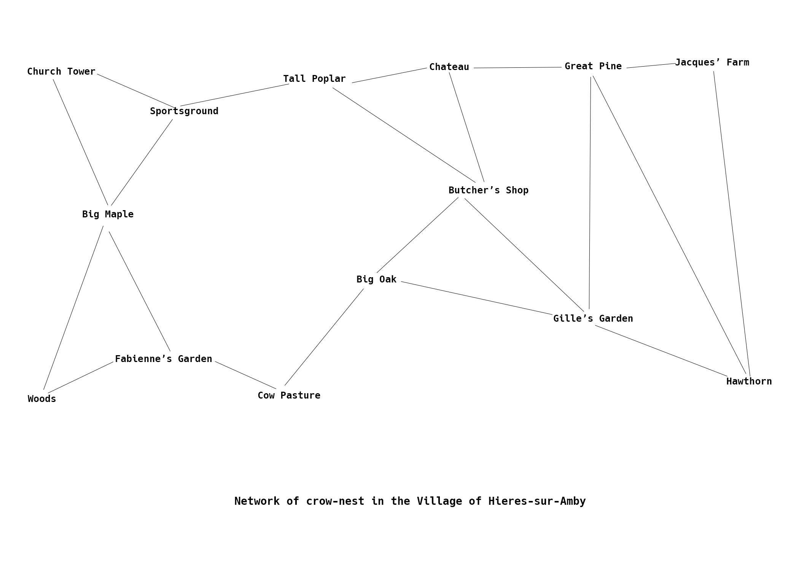

# Network
 
A graphical illustration of the Crow Network.

The code in this project is an excerpt from Chapter 11 [Asynchronous Programming](https://eloquentjavascript.net/11_async.html) of [Eloquent JavaScript](https://eloquentjavascript.net) by [Marijn Haverbeke](https://github.com/marijnh)

At first, I thought the chapter was challenging, but it turned out to be one of the most interesting chapters in Part 1 of the book.

As a JS beginner like you, I would like to explain how I was able to understand this chapter.

- Before you start, I would highly recommend you read *Asynchronous JavaScript* in [JavaScript The Definitive Guide, by David Flanagan](https://www.oreilly.com/library/view/javascript-the-definitive/9781491952016/) and *Chapter 1,2 and 3* of [You Don't know JS yet Async and Performance, by Kyle Simpson ](https://www.amazon.com/You-Dont-Know-JS-Performance/dp/1491904224)
- If you don't know modules in javascript, you can quickly glance through *Module* in [JavaScript The Definitive Guide, by David Flanagan](https://www.oreilly.com/library/view/javascript-the-definitive/9781491952016/) to know what module is and the difference between `.js` and `.mjs` extensions. 
- And once you are done, you can head on to the [Eloquent JavaScript website](https://eloquentjavascript.net/code/#11) to get the chapter code, copy and paste it on your local machine.
- Take your time to understand what the code is all about. *The main aim of the author is to give you the ability to read and understand codes*. And I cannot bridge that gap. I also recommend you dedicate your time to studying the chapter thoroughly. It took me roughly 1 month to complete this chapter due to the lack of a guide. Each time I googled, everyone said the book was a terrible one, too difficult for beginners, etc. But I would gladly tell you that everything is false. If your main aim is to become a very strong programmer(like I am aiming), then this book is one of those books you must read.
- According to the author, "*most of the code in this chapter is meant to be executed in a web browser*". This is not on `Node.js`. If, however, you prefer the Node environment like I do, you can clone this repository and use it instead. And I also made it easy to follow by modularizing each subsection, so you can follow the chapter more effectively. About 98 percent of the code in this repository is the way the author wrote it, but I changed some parts for clarity. Wishing you all the best as well.

